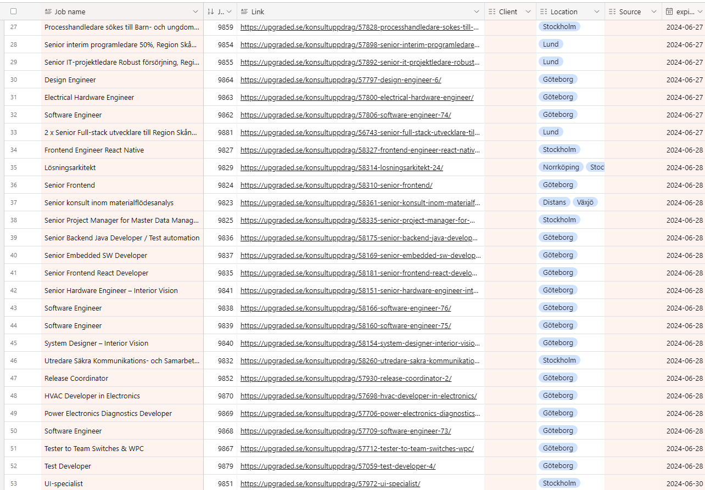
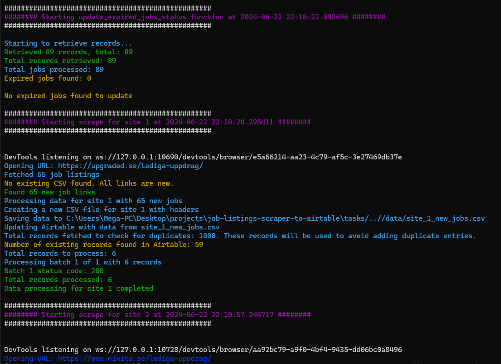

## Scheduled Job Listings Scraper and Airtable Updater

A Python-based tool that scrapes multiple Swedish job listings sites, processes the data, updates Airtable, and reruns on a schedule. it also regularly updates the status of expiring jobs to ensure the database remains up to date.


## Features

- **Scraping**: Extracts job data from multiple job sites.
- **Processing**: Organizes and saves the scraped data into CSV files.
- **Updating**: Uploads the new job data to Airtable.
- **Scheduling**: Automates the entire process at regular intervals, repeating the scraping, processing, and updating steps.
- **Maintenance**: Manages expired job statuses.





## Quick Start

1. Clone the repository:
   ```
   git clone https://github.com/aladynjr/scheduled-job-listings-scraper-airtable-updater.git
   ```

2. Install dependencies:
   ```
   pip install -r requirements.txt
   ```

3. Configure environment variables in a `.env` file (see `.env.example`). Ensure you set up your Airtable API key, base ID, and table IDs.

4. Run the script:
   ```
   ./start.sh
   ```

## Output

Generates CSV files in the `data` directory:
- `site_<site_number>_scraped_data.csv`: Job data for each site
- `site_<site_number>_new_jobs.csv`: New job data for Airtable

## Project Structure

```
scheduled-job-listings-scraper-airtable-updater/
│
├── config.py
├── main.py
├── requirements.txt
├── .env.example
│
├── tasks/
│   ├── scrape_all_sites_task.py
│   └── update_expired_jobs_task.py
│
├── scrapers/
│   ├── job_site_1_scraper.py
│   ├── job_site_2_scraper.py
│   ├── job_site_3_scraper.py
│   ├── job_site_4_scraper.py
│   └── job_site_5_scraper.py
│
├── utils/
│   └── update_airtable_with_csv.py
│
└── start.sh
```

## Technologies

- Python
- Pandas
- Schedule
- Airtable API


## Disclaimer

This tool is for demonstration purposes only. The data scraped is publicly available, and the usage of this tool should comply with each job site's terms of service. Ensure you have the necessary permissions to scrape and use the data.